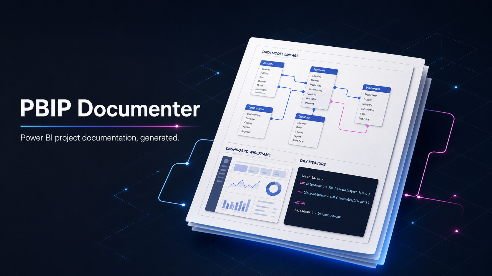

# PBIP Documenter

[](https://github.com/analienx/pbip-documenter/actions/workflows/ci.yml)
[](https://pypi.org/project/pbip-documenter/)
[](https://pypi.org/project/pbip-documenter/)
[](LICENSE)



Turn a Power BI PBIP or PBIR project into a review-ready Word design
specification: semantic model, DAX, relationships, report pages, wireframes,
lineage, and maintainability observations.

## Install and run

```powershell
pipx install pbip-documenter
pbip-documenter examples/contoso-retail --mode full -o contoso-retail.docx
```

`pip install pbip-documenter` works too. The CLI never installs dependencies
into your environment at runtime.

The included **Contoso Retail** project is fictional and safe to use in demos.
Open the generated `.docx` in Word and update its table-of-contents fields.

## What it documents

- Semantic-model tables, columns, measures, DAX, relationships, roles, and partitions.
- Report pages, visuals, filters, bookmarks, drill-through, themes, and bindings.
- Native Word schema, lineage, and page-wireframe diagrams.
- Actionable naming, dependency, privacy, and maintainability observations.

## Commands

```powershell
# Concise document (the default)
pbip-documenter path\to\report

# Full document
pbip-documenter path\to\report --mode full

# Check the installed version
pbip-documenter --version
```

See the [CLI reference](docs/CLI.md), [sample output gallery](docs/EXAMPLES.md),
and [advanced inventory guide](docs/INVENTORY.md).

## Independent visual quality (opt-in)

The [Visual Quality System](docs/VISUAL_QUALITY_SYSTEM.md) independently examines
source-bound, **rendered Power BI pages and paginated Word output** against a
versioned rubric for readability, axis density, padding, theming, color, chart
choice, whitespace, tables, page breaks, and document/report consistency.
It exposes preflight, review requests, strict verification, and a resumable
render/review/repair loop. Image-review and repair agents must be explicitly
configured; static PBIR/OOXML validity is never presented as visual approval.
## Privacy and scope

PBIP Documenter reads project files and writes a `.docx`; it does not alter
source reports. The core workflow is local-only. Power BI, Jira, SharePoint,
and cache-backed augmentation are advanced, opt-in integrations and may need
their optional dependencies and credentials.

Do not commit client PBIP projects, generated documents, credentials, or cache
contents. Use the synthetic sample for public issues and pull requests.

## Contributing

Issues and pull requests are welcome. Start with
[Contributing](CONTRIBUTING.md), use [GitHub Discussions](https://github.com/analienx/pbip-documenter/discussions)
for questions, and report vulnerabilities through the private process in
[Security](SECURITY.md).

## License

Apache-2.0. See [LICENSE](LICENSE) and [NOTICE](NOTICE).
