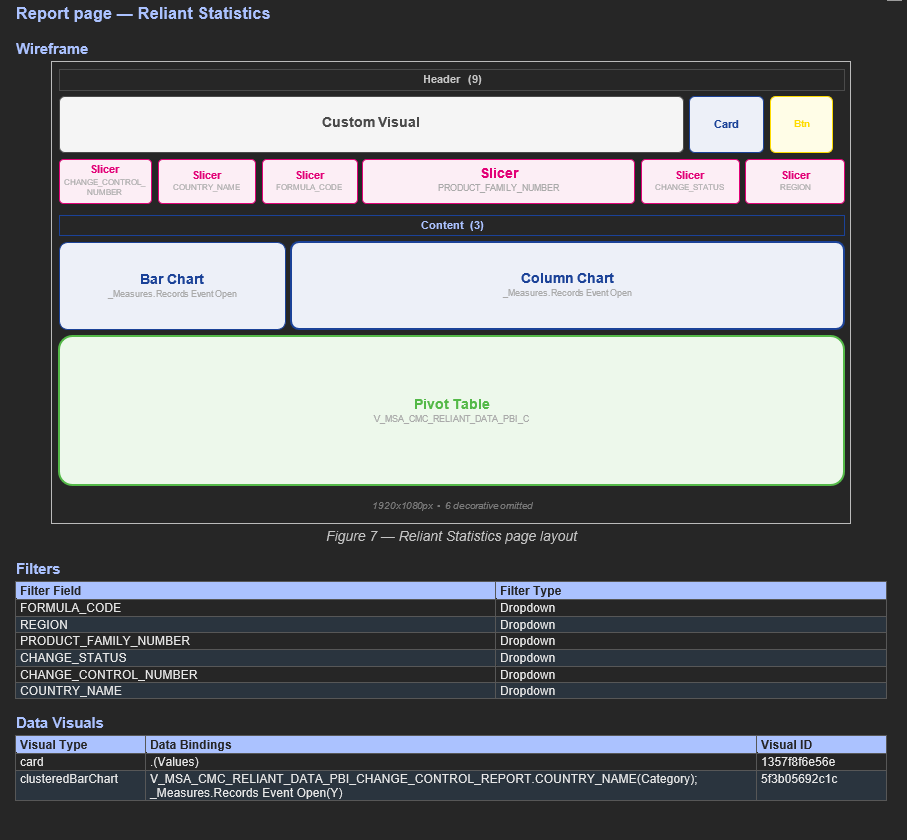
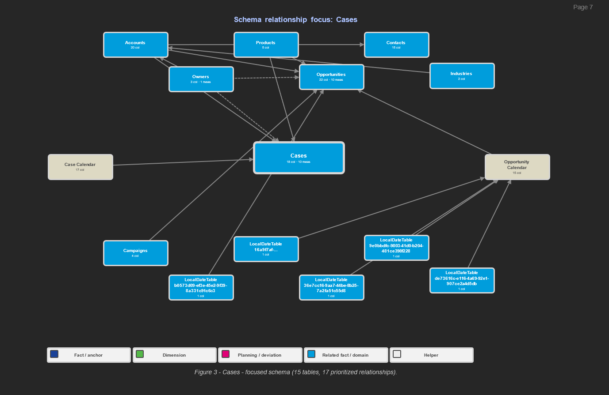
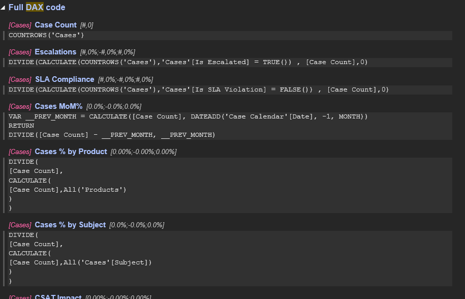
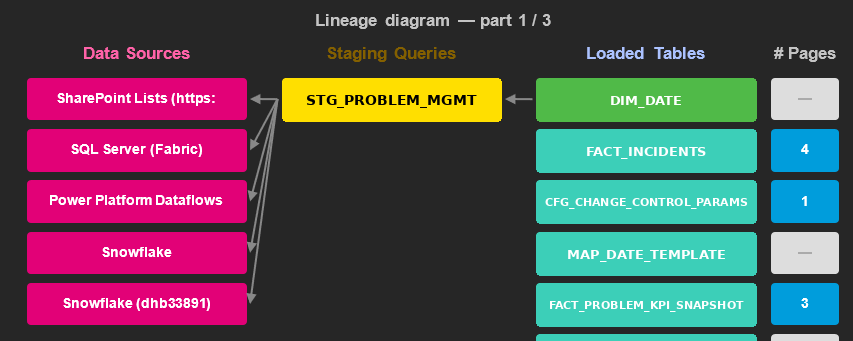
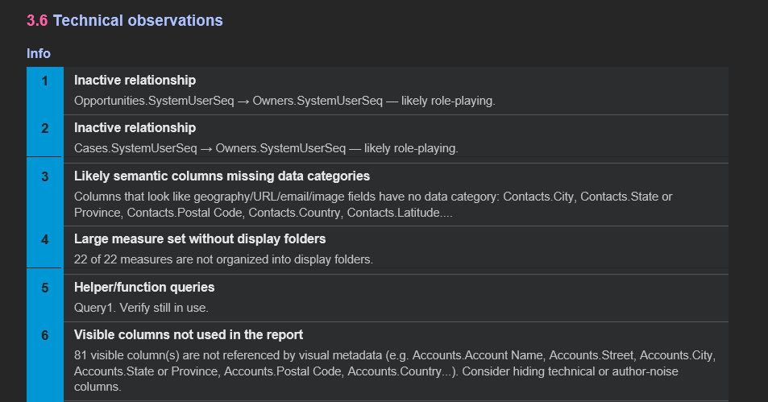
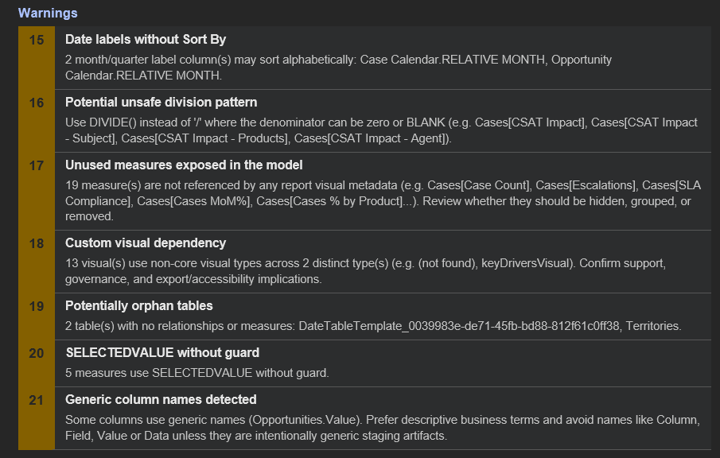

# Example Outputs

Below is a visual walkthrough of the **Design Specification** documents generated by `pbip_documenter`.

---

## Page Wireframe

Each report page is rendered as a proportional wireframe showing every visual's position, size, and type (table, card, slicer, chart, button, custom visual, etc.).  Boxes are colour-coded by category and collapsed button groups are shown as a single labelled item so the diagram never overflows the page.

This example shows the **Reliant Statistics** page (1920×1080 px) with a header band (custom visual, card, button), six slicers, bar and column charts, and a large pivot table bound to `V_MSA_CMC_RELIANT_DATA_PBI_C`.  Filter and visual-binding metadata are listed beneath the diagram.



---

## Data Model Schema

### Star-schema relationship diagram

Rendered natively inside Word, the diagram centres **fact tables** and arranges **dimension tables** around them.  Active relationships are shown in solid blue; inactive relationships appear as dashed grey lines.

The screenshot below focuses on the **Cases** fact table (page 7 of the schema), showing 15 related tables and 17 prioritized relationships — including Accounts, Products, Contacts, Opportunities, Owners, Campaigns, and auto-generated `LocalDateTable` tables.



---

## DAX Measures & Calculated Columns

All DAX formulas are extracted, formatted in monospace, and grouped by table for easy review.

Below are six measures from the **Cases** table — *Case Count*, *Escalations*, *SLA Compliance*, *Cases MoM%*, *Cases % by Product*, and *Cases % by Subject* — illustrating `COUNTROWS`, `DIVIDE`/`CALCULATE`, `DATEADD`, and `ALL()` patterns.



---

## Data Lineage Diagram

End-to-end flow from raw data sources through intermediate transforms to final report visuals.  Connectors are colour-coded by layer (source → model → report) and page-usage counts are shown alongside loaded tables.

The first of three lineage pages shows five data sources (SharePoint Lists, SQL Server / Fabric, Power Platform Dataflows, and two Snowflake connections) feeding into a single staging query `STG_PROBLEM_MGMT`, which loads five tables: `DIM_DATE`, `FACT_INCIDENTS`, `CFG_CHANGE_CONTROL_PARAMS`, `MAP_DATE_TEMPLATE`, and `FACT_PROBLEM_KPI_SNAPSHOT`.



---

## Observations & Naming Analysis

The analyser flags naming-convention inconsistencies and structural issues so they can be cleaned up before publishing.

The screenshot below (section 3.6) lists six **Info**-severity observations: inactive role-playing relationships, semantic columns missing data categories, measures lacking display folders, a potentially unused helper query (`Query1`), and 81 visible columns unreferenced by any report visual.



---

## Privacy & Warning Checks

Built-in heuristics detect patterns that commonly cause report bugs or maintenance headaches.

The warnings panel below (items 15–21) flags: date labels without *Sort By*, unsafe division patterns (recommending `DIVIDE()`), 19 unused measures, custom-visual dependencies, two orphan tables, five `SELECTEDVALUE` calls without guards, and generic column naming (`Opportunities.Value`).



---

## How to generate these outputs

```powershell
# Concise mode (default)
python -m pbip_documenter

# Full mode with every detail
python -m pbip_documenter --mode full
```

Generated files appear in `Exported Documents/` next to the tool.
